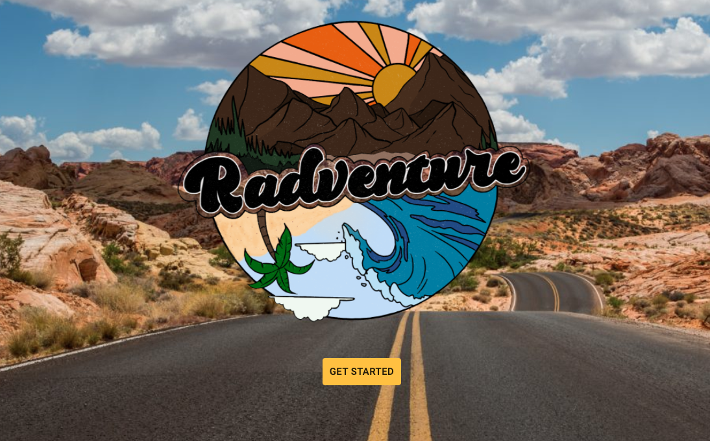
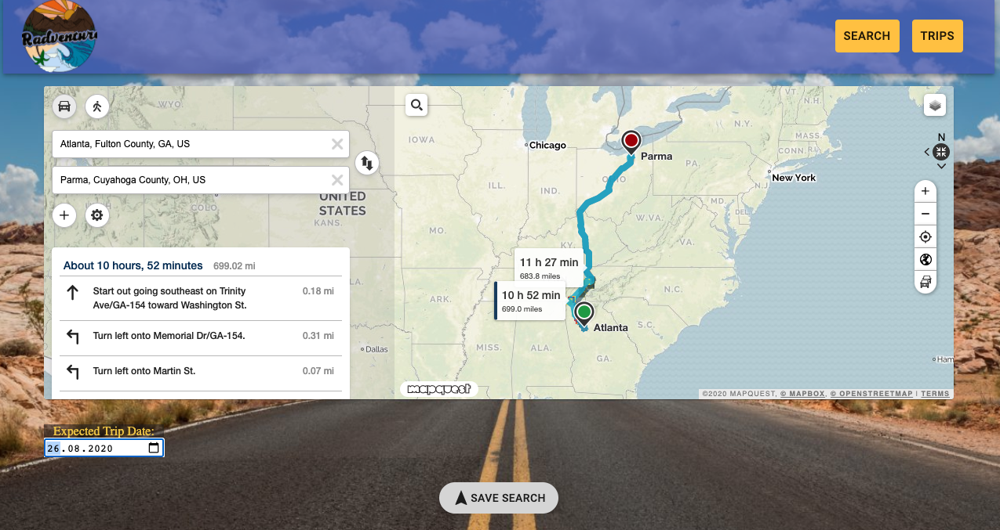
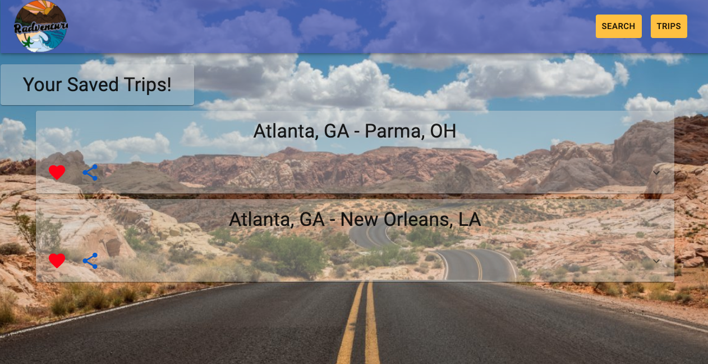
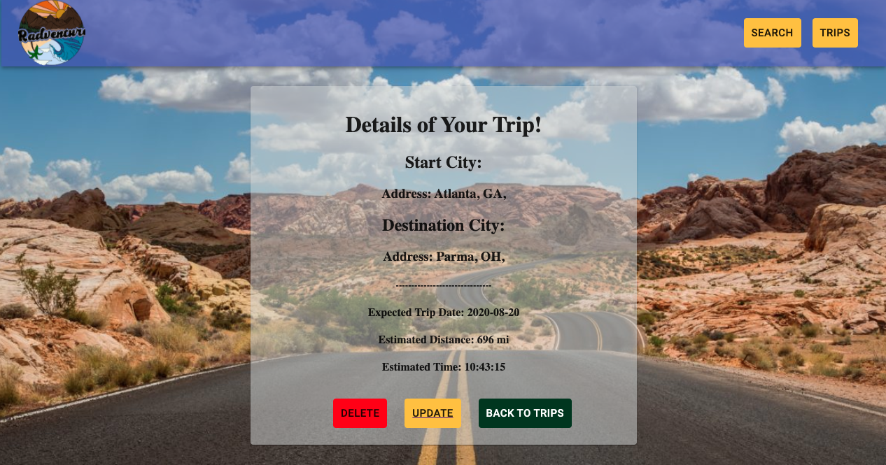

# Radventure

## Table of Contents

* [Installation](#installation)
* [Usage](#usage)
* [Credits](#credits)
* [MIT License](#mit_license)

## Installation
1. Clone the repo.
2. Run npm install in terminal.
3. Run npm start in terminal.

## Usage

This is MERN application  was created for people who want to keep truck of their trips app. Below you can find elevator pitch for this app.

When you go on vacation, you want to be able to enjoy the full experience including a few extra stops on the way(whether that be restaurants, gas stations, or local attractions). This app was made to handle the hard part. You simply type in the location of point A to point B, type in destinations you want to see in between, and just follow the map! It makes it easier to see all the amazing sights and top rated food that you’ve been wanting to see or eat! Our app will also display the total time and distance the trip is going to take from beginning to end. If you decide you want to sign up, you will be able to save your trips once they’re done so you’ll be able to see all of your past trips or upcoming trips. If you don’t want to sign up, that’s okay too! You can still use our app just for that particular trip!

[Link to the Deployed Radventure App](https://radven.herokuapp.com/)

## Collaborators

This app was created by  Alexis Mollenkopf, Chad DuBay, James Holding and Volodymyr Petrytsya.

## MIT License 

Copyright (c) [2020] [Volodymyr Petrytsya]

Permission is hereby granted, free of charge, to any person obtaining a copy
of this software and associated documentation files (the "Software"), to deal
in the Software without restriction, including without limitation the rights
to use, copy, modify, merge, publish, distribute, sublicense, and/or sell
copies of the Software, and to permit persons to whom the Software is
furnished to do so, subject to the following conditions:

The above copyright notice and this permission notice shall be included in all
copies or substantial portions of the Software.

THE SOFTWARE IS PROVIDED "AS IS", WITHOUT WARRANTY OF ANY KIND, EXPRESS OR
IMPLIED, INCLUDING BUT NOT LIMITED TO THE WARRANTIES OF MERCHANTABILITY,
FITNESS FOR A PARTICULAR PURPOSE AND NONINFRINGEMENT. IN NO EVENT SHALL THE
AUTHORS OR COPYRIGHT HOLDERS BE LIABLE FOR ANY CLAIM, DAMAGES OR OTHER
LIABILITY, WHETHER IN AN ACTION OF CONTRACT, TORT OR OTHERWISE, ARISING FROM,
OUT OF OR IN CONNECTION WITH THE SOFTWARE OR THE USE OR OTHER DEALINGS IN THE
SOFTWARE.